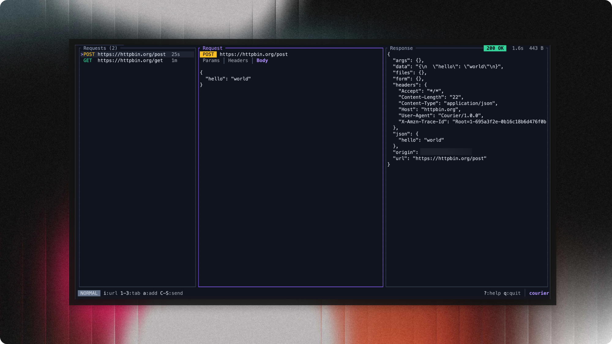

# Courier

A fast, lightweight TUI HTTP client for testing APIs faster than ever, all from the terminal.

<p align="center">
  
</p>

## Installation

Build from source:

```bash
git clone https://github.com/janaSunrise/courier
cd courier
cargo build --release
```

## Usage

```bash
cargo run
```

### Keybindings

Vim-style navigation throughout.

| Key | Action |
|-----|--------|
| `Tab` / `h` / `l` | Switch panels |
| `j` / `k` | Navigate / scroll |
| `1` / `2` / `3` | Switch tabs (Params, Headers, Body) |
| `n` | New request |
| `Enter` | Select / edit |
| `i` | Edit URL |
| `a` | Add param/header |
| `e` | Edit body |
| `d` | Delete |
| `Space` | Toggle param/header |
| `Ctrl+S` | Send request |
| `Ctrl+F` | Format JSON |
| `?` | Help |
| `q` | Quit |

## License

Distributed under the MIT License.
